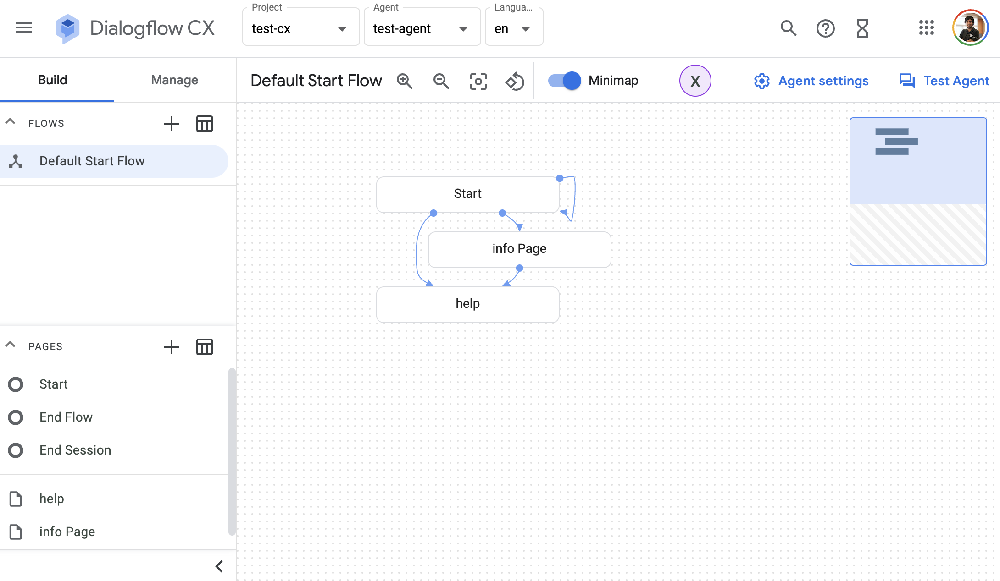
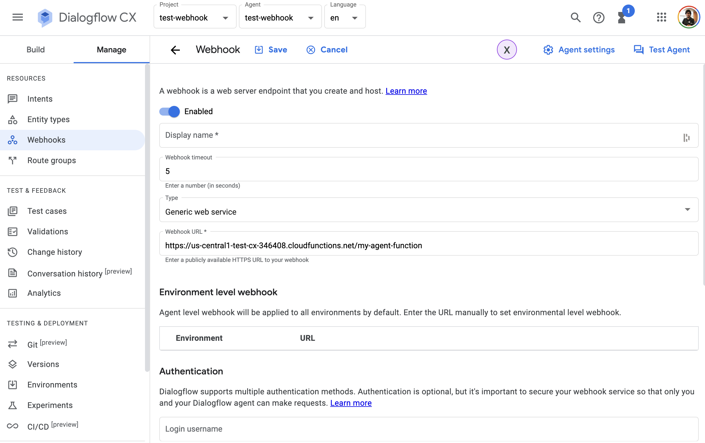
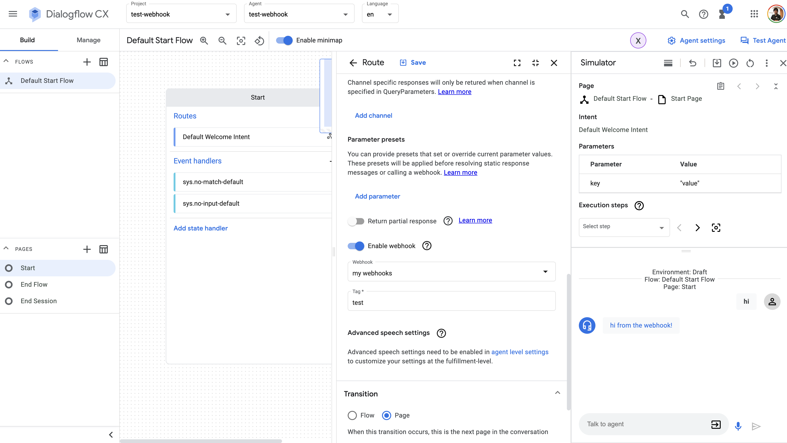
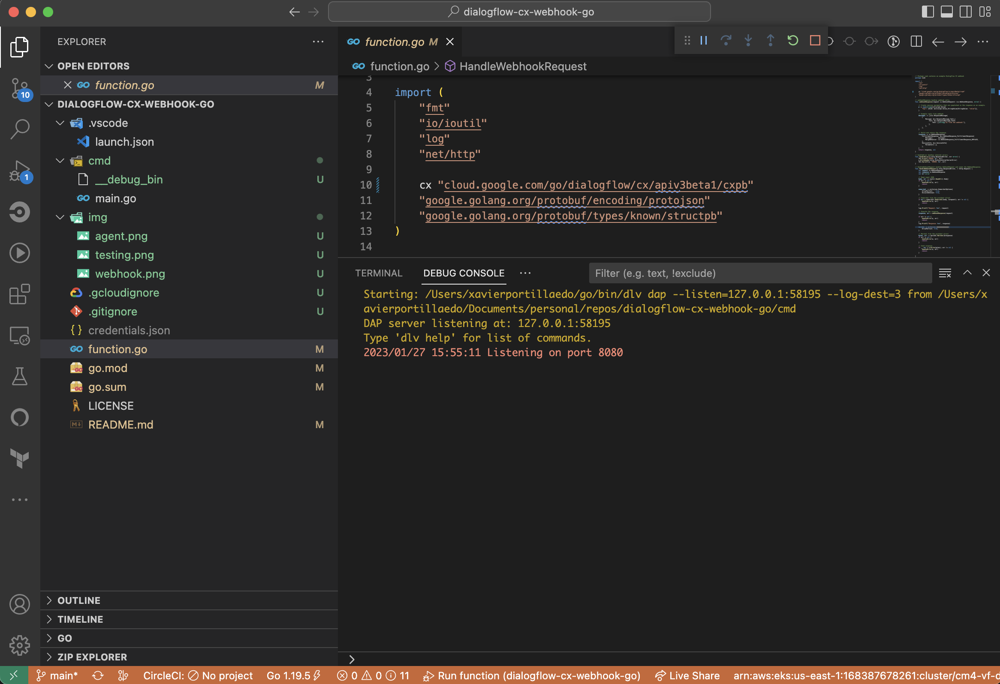
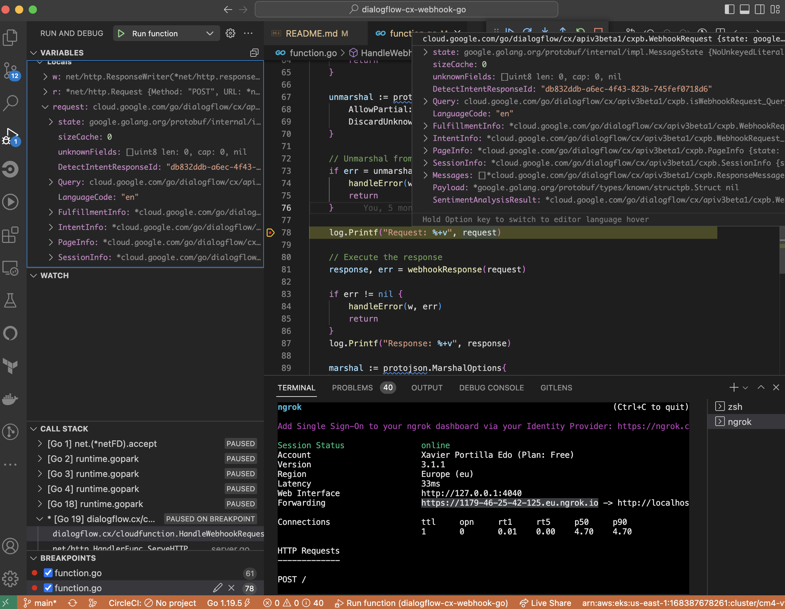
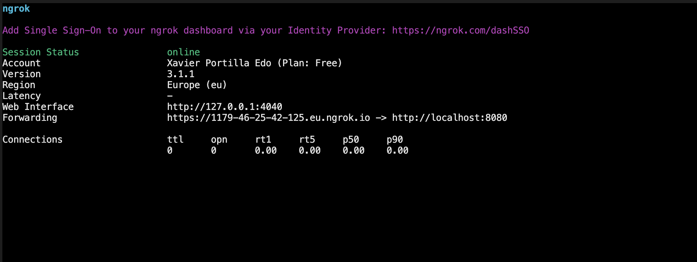

<!-- TOC -->

- [Dialogflow CX Webhooks with Golang](#dialogflow-cx-webhooks-with-golang)
  - [Prerequisites](#prerequisites)
  - [Creating the Dialogflow CX Agent with the Console](#creating-the-dialogflow-cx-agent-with-the-console)
  - [Project Files](#project-files)
  - [Google Cloud function in golang](#google-cloud-function-in-golang)
  - [Deploying your Dialogflow CX Webhook](#deploying-your-dialogflow-cx-webhook)
  - [Dialogflow CX Console](#dialogflow-cx-console)
    - [Testing your Dialogflow CX Agent](#testing-your-dialogflow-cx-agent)
  - [Local](#local)
    - [Building the Dialoglfow CX Webhook](#building-the-dialoglfow-cx-webhook)
    - [Running the Dialogflow CX Webhook](#running-the-dialogflow-cx-webhook)
    - [Debugging the Dialogflow CX webhook](#debugging-the-dialogflow-cx-webhook)
    - [Testing requests locally](#testing-requests-locally)
  - [Hybrid](#hybrid)
    - [Port-forwarding requests directly from Dialogflow CX Console to your laptop](#port-forwarding-requests-directly-from-dialogflow-cx-console-to-your-laptop)
  - [Resources](#resources)
  - [Conclusion](#conclusion)

<!-- /TOC -->


# Dialogflow CX Webhooks with Golang

Dialogflow CX Webhooks can be developed using Google Cloud functions or a REST API endpoint.
Google Cloud Function function is Googles's implementation of serverless functions available in GCP. 
Google recommends using Google Cloud Function functions for Dialogflow CX development.
 
In this post, we will implement a Dialogflow CX Agent by using Golang, protobuf and Google Cloud Functions. This project is basically a Hello World example. 

This post contains materials from different resources that can be seen in the Resources section.

## Prerequisites

Here you have the technologies used in this project
1. Google Cloud Account - [Sign up here for free](https://cloud.google.com/)
2. Dialogflow API enabled - [How to enable it](https://cloud.google.com/dialogflow/cx/docs/reference)
3. gcloud CLI - [Install and configure gcloud CLI](https://cloud.google.com/sdk/docs/install)
4. Dialogflow CX CLI - [Install and configure Dialogflow CX CLI](https://cxcli.xavidop.me/)
5. Node.js v10.x
6. Visual Studio Code
7. Dialogflow CX for Golang (Version >=1.23.0)
8. ngrok

The Google Cloud Command Line Interface (`gcloud` CLI) is a tool for you to manage your Google Cloud serverless functions and related resources.
`cxcli` CLI allows you to manage Dialogflow CX Agents programmatically from the command line.
We will use these powerful tools to create, build, deploy and manage our Hello World Dialogflow CX agent. Let's start!

## Creating the Dialogflow CX Agent with the Console

For creating the Dialogflow CX Agent, you will need to go to the Dialogflow CX Console and create an agent. Once you have your agent created, you will see the design view:



And that's it, with these steps you have created your first Dialogflow CX agent. You only have to deploy your local changes. We are going to explain it in the next steps.

## Project Files 

These are the main files of the project:

```bash
├── cmd
│   └── main.go
├── function.go
├── go.mod
└── go.sum
```

* `cmd`: The folder that contains all we need to spin up a local server for debugging.
  * `main.go`: file that contains a `main()` method and runs a local server listening in port `8080`.
* `function.go`: the Google Cloud Function main entry point.
* `go.mod`: this file is core to the Golang ecosystem and is a basic part of understanding and working with golang.
* `go.sum`: this file lists down the checksum of direct and indirect dependency required along with the version
## Google Cloud function in golang

The Dialogflow CX SDK for Golang makes it easier for you to build highly engaging dialogflow CX conversations by allowing you to spend more time implementing features and less time writing boilerplate code.

You can find documentation, samples and helpful links in their official [GitHub repository](https://github.com/googleapis/google-cloud-go/tree/main/dialogflow/cx/apiv3)

The main Golang file in our Google Cloud Function project is `function.go` located in the root folder. This file contains all handlers.

The `HandleWebhookRequest` function is executed every time Dialogflow CX calls the webhook. 

```go

// HandleWebhookRequest handles WebhookRequest and sends the WebhookResponse.
func HandleWebhookRequest(w http.ResponseWriter, r *http.Request) {
	var request cx.WebhookRequest
	var response cx.WebhookResponse
	var err error

	// Read input JSON
	body, err := ioutil.ReadAll(r.Body)
	if err != nil {
		handleError(w, err)
		return
	}

	unmarshal := protojson.UnmarshalOptions{
		AllowPartial:   true,
		DiscardUnknown: true,
	}

	// Unmarshal from the protobuf struct
	if err = unmarshal.Unmarshal(body, &request); err != nil {
		handleError(w, err)
		return
	}

	log.Printf("Request: %+v", request)

	// Execute the response
	response, err = webhookResponse(request)

	if err != nil {
		handleError(w, err)
		return
	}
	log.Printf("Response: %+v", response)

	marshal := protojson.MarshalOptions{
		AllowPartial: true,
	}

	// Marshal from the protobuf struct
	bytes, err := marshal.Marshal(&response)
	if err != nil {
		handleError(w, err)
		return
	}

	// Send response
	if _, err = w.Write(bytes); err != nil {
		handleError(w, err)
		return
	}

}

```
It is important to notice here that to have a better development experience, we are using `protobuf` structs from the Dialogflow CX SDK. This is why we are marshaling and unmarshaling using the `protojson` library.

## Deploying your Dialogflow CX Webhook

With the code ready to go, we need to deploy it on Google Cloud so it can be connected to the agent.

Before we continue, make sure that you have enabled the Cloud functions API enabled:

```bash
    gcloud services enable cloudfunctions.googleapis.com
```

Now we can deploy our webhook with gcloud CLI on the root folder:

```bash
    gcloud functions deploy my-agent-function --runtime go119 --trigger-http --entry-point HandleWebhookRequest
```

The public endpoint of this function is going to have this format:
```bash
    https://<region>-<project-id>.cloudfunctions.net/<function-name>
```

So imagine that we have deployed this function in `us-central1` and the project `test-cx-346408`, the URL will look like this:
```bash
    https://us-central1-test-cx-346408.cloudfunctions.net/my-agent-function
```

Now the code is ready to be tested on the Console!

## Dialogflow CX Console

### Testing your Dialogflow CX Agent

Once you have deployed your changes, you can go to your Dialogflow CX Agent on the console and create a Webhook:



Once you have added your webhook in your agent, you can go to any flow and set it wherever you need. Then you just need to test it in the simulator!



## Local

### Building the Dialoglfow CX Webhook

Inside `go.mod`, we will almost always find metadata specific to the project. 
This metadata helps identify the project and acts as a baseline for users and contributors to get information about the project.

Here is how this file looks like:

```go

module dialogflow.cx/cloudfunction

go 1.16

require (
	cloud.google.com/go/dialogflow v1.26.0
	google.golang.org/protobuf v1.28.1
)

```

For downloading our Webhook dependencies, we can run the following command:

```bash

  go mod tidy

```

This command installs a package, and any packages that it depends on. 
If the package has a go.sum file, the installation of dependencies will be driven by that.

To build the webhook just run:
```bash

    go build -o webhook .

```

### Running the Dialogflow CX Webhook

The `launch.json` file in `.vscode` folder has the configuration for Visual Studio Code which allow us to run our lambda locally:

```json

{
    "version": "0.2.0",
    "configurations": [
        {
            "name": "Run function",
            "type": "go",
            "request": "launch",
            "mode": "debug",
            "program": "${workspaceFolder}/cmd/main.go",
            "env": {
                "ENV": "development"
            }
        }
    ]
}

```
This configuration file will execute the following command:

```bash

dlv dap --listen=127.0.0.1:52462 --log-dest=3 from /Users/xavierportillaedo/Documents/personal/repos/dialogflow-cx-webhook-go/cmd

```

For a new incoming request a new server is running listening in port `8080`.
From the data received on the server the request body is extracted, parsed into JSON and passed to the webhook invoker's serverless function handler.
The response from the lambda serverless function is parsed as Dialogflow CX protobuf format as specified [here](https://pkg.go.dev/cloud.google.com/go/dialogflow@v1.23.0/cx/apiv3beta1/cxpb)
The response is written onto the server and returned.

After configuring our launch.json file and understanding how the local debugger works, it is time to click on the play button:



After executing it, you can send Dialogflow CX POST requests to http://localhost:8080.

### Debugging the Dialogflow CX webhook

Following the steps before, now you can set up breakpoints wherever you want inside all Golang files in order to debug your webhook:



### Testing requests locally

I'm sure you already know the famous tool called [Postman](https://www.postman.com/). REST APIs have become the new standard in providing a public and secure interface for your service. Though REST has become ubiquitous, it's not always easy to test. Postman, makes it easier to test and manage HTTP REST APIs. Postman gives us multiple features to import, test and share APIs, which will help you and your team be more productive in the long run.

After running your application you will have an endpoint available at http://localhost:8080. With Postman you can emulate any Dialogflow CX Request. 

For example, you can test this Request:

```json

{
   "detectIntentResponseId":"dsfsdaf-c5c9-46ce-bf2c-935396c08926",
   "intentInfo":{
      "lastMatchedIntent":"projects/my-project-123/locations/us-central1/agents/sddadsa-576c-4bbb-bc27-34c276bfecd5/intents/00000000-0000-0000-0000-000000000000",
      "displayName":"Default Welcome Intent",
      "confidence":0.6684057
   },
   "pageInfo":{
      "currentPage":"projects/my-project-123/locations/us-central1/agents/sadasd-d5fc-4eb7-88fc-c25169027aee/flows/68f7790d-5c1f-4546-bb53-8d641f8288b4/pages/21939010-3336-450d-ae8b-0c9926aec791",
      "formInfo":{
         "parameterInfo":[
            {
               "displayName":"pokemon",
               "required":true,
               "state":"FILLED",
               "value":"pikachu"
            }
         ]
      }
   },
   "sessionInfo":{
      "session":"projects/my-project-123/locations/us-central1/agents/sadasd-d5fc-4eb7-88fc-c25169027aee/sessions/7fab78-aac-10e-989-d99313ca4",
      "parameters":{
         "pokemon":"pikachu"
      }
   },
   "fulfillmentInfo":{
      "tag":"test"
   },
   "text":"Hi!",
   "languageCode":"en"
}

```

The response from this example webhook is gonna be this one:
```json
{
  "fulfillmentResponse": {
    "messages": [
      {
        "text": {
          "text": [
            "hi from the webhook!"
          ]
        }
      }
    ],
    "mergeBehavior": "REPLACE"
  },
  "sessionInfo": {
    "parameters": {
      "key": "value"
    }
  }
}
```

## Hybrid
### Port-forwarding requests directly from Dialogflow CX Console to your laptop

ngrok is a very cool, lightweight tool that creates a secure tunnel on your local machine along with a public URL you can use for browsing your local site or APIs.

When ngrok is running, it listens on the same port that you’re local web server is running on and proxies external requests to your local machine

From there, it’s a simple step to get it to listen to your web server. Say you’re running your local web server on port 8080. In a terminal, you’d type in: `ngrok http 8080`. This starts ngrok listening on port 8080 and creates the secure tunnel:



So now you have to go to [Dialogflow CX console](https://dialogflow.cloud.google.com/cx/), go to your Agent > webhooks and add the https url generated above. Eg: https://1179-46-25-42-125.eu.ngrok.io.

Go to the Simulator tab in the Dialogflow CX Console and launch your agent.

The Dialogflow CX Console will send an HTTPS request to the ngrok endpoint (https://1179-46-25-42-125.eu.ngrok.io) which will route it to your webhook running on Web API server at http://localhost:8080.

## Resources
* [Official Dialogflow CX Golang SDK](https://github.com/googleapis/google-cloud-go/tree/main/dialogflow/cx/apiv3) - Official Dialogflow CX Golang SDK
* [Official Dialogflow CX Documentation](https://cloud.google.com/dialogflow/cx/docs) - Official Dialogflow CX Documentation

## Conclusion 

This was a basic tutorial to learn Dialogflow CX webhooks using Golang.
As you have seen in this example, the Dialoglfow CX SDK for Golang and the Dialogflow CX Tools like gcloud and `cxcli` CLIs can help us a lot and also they give us the possibility to create Agents and conversations easily. 
I hope this example project is useful to you.

That's all folks!

Happy coding!